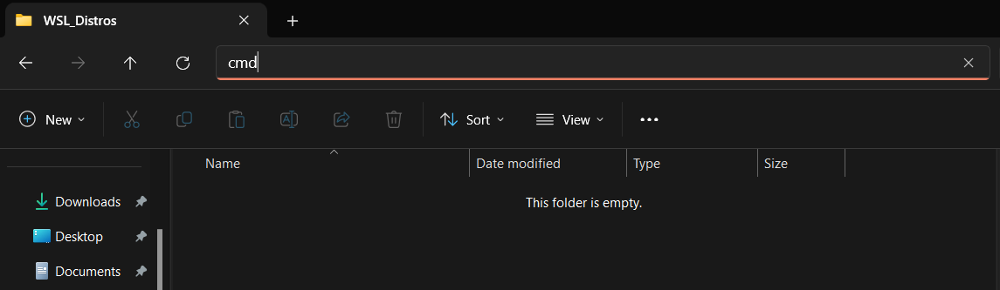

# ESP8266 RTOS SDK Toolchain Setup
Toolchain for development of RTOS applications for ESP8266 using [WSL 1 (Windows Subsystem for Linux)](https://learn.microsoft.com/en-us/windows/wsl/about) and programming using USB-UART converter. Using WSL makes it portable across multiple Windows devices.

## Why WSL 1?
- WSL 1 directly maps connected COM**X** devices to /dev/ttyS**X** files
- WSL 2 works using [usbipd](https://learn.microsoft.com/en-us/windows/wsl/connect-usb), but:
    - After disconnecting the device you have to attach it manually again
    - Interacting with files that are being stored on Windows filesystem is slow ([stackoverflow](https://stackoverflow.com/questions/68972448/why-is-wsl-extremely-slow-when-compared-with-native-windows-npm-yarn-processing))
- [Oracle VirtualBox](https://www.virtualbox.org/) provide COM ports mapping for virtual machines, but:
    - After testing it using [AntiX 23.1 Core](https://antixlinux.com/download/) virtual machine, there is a significant delay that made it impossible to program an ESP
    - While receiving longer messages by UART (using monitor tool), part of the message is being lost
- [Docker](https://www.docker.com/) cannot be used on Windows, because as of today (15.07.2024) it doesn't support mapping USB devices to containers

## 1. WSL Setup
### 1.1 Create a folder to store new WSL machine somewhere.
For example `Documents/WSL_Distros/`

You can use this folder or create another one to manage multiple toolchain WSL's.

### 1.2 Open CMD in newly created folder
**Tip** You can open command line in given folder by typing *cmd* in file explorer url tab:


### 1.3 Install Debian WSL image
It can be achieved by using command below or by installing it using [Windows Store](https://apps.microsoft.com/detail/9msvkqc78pk6)
```
wsl --install -d Debian
```
Go through installation steps, newly created account doesn't matter as is the next step the machine is going to be exported and it will lose all users accounts.

### 1.4 Export Debian image
Export Debian image to *debianExport* file.
```
wsl --export Debian debianExport
```
Import previously exported image here to machine named Debian_ESP8266 using WSL 1.
```
wsl --import Debian_ESP8266 . debianExport --version 1
```
**(Optional)** You can delete debianExport file
```
del debianExport
```

## 2. Debian setup
This is essentially doing everything listed in [Get Started guide](https://docs.espressif.com/projects/esp8266-rtos-sdk/en/latest/get-started/index.html) and [Standard Setup of Toolchain](https://docs.espressif.com/projects/esp8266-rtos-sdk/en/latest/get-started/linux-setup.html#install-prerequisites) with slight fixes.
### 2.1 Login to WSL and get repository updates
Open WSL in current folder.
```
wsl -d Debian_ESP8266
```
Get updates and install them.
```
sudo apt-get update
sudo apt-get upgrade
```

### 2.2 Download packages and SDK
Slightly modified prompt from [here](https://docs.espressif.com/projects/esp8266-rtos-sdk/en/latest/get-started/linux-setup.html#install-prerequisites).
```
sudo apt-get install gcc git wget make libncurses-dev flex bison gperf python3 python3-pip virtualenv python-is-python3
```
Now you can download [ESP8266 RTOS SDK](https://github.com/espressif/ESP8266_RTOS_SDK).
```
git clone --recursive https://github.com/espressif/ESP8266_RTOS_SDK.git
cd ESP8266_RTOS_SDK
```
### 2.3 Execute installation script
```
sudo ./install.sh
```
And then export environmental variables using `export.sh` script. It has to be sourced.
```
source export.sh
```
### 2.4 Modify .bashrc
Modify `.bashrc` file to execute export script everytime you login into WSL.
```
sudo nano ~/.bashrc
```
Add following lines to the end of the file. IDF_PATH is a path to previously cloned repository on your machine. 
```
export IDF_PATH="$HOME/ESP8266_RTOS_SDK"
source $IDF_PATH/export.sh > /dev/null
```
Source command output is redirected to `/dev/null` as `export.sh` would print some information everytime you login to the system.

## All done!